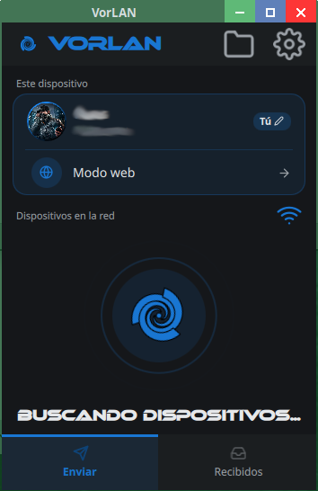
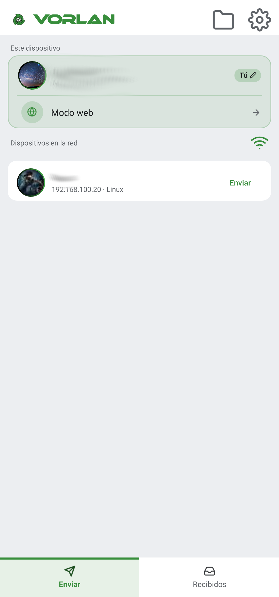

# VorLAN

Transferencia de archivos por LAN — sin internet, sin cuentas.

Con funcionalidades que van más allá: modo web, cifrado TLS, cola de envíos a múltiples dispositivos, 11 idiomas y soporte para Android TV.

## Características

- **Transferencia directa** — Envía archivos, carpetas y texto entre dispositivos de tu red local sin conexión a internet.
- **Modo web** — Cualquier dispositivo con navegador (iPhone, PC ajeno, etc.) puede enviar/recibir archivos sin instalar VorLAN. Incluye QR para conexión rápida.
- **Cifrado TLS** — Opcional, protege las transferencias con encriptación.
- **PIN de seguridad** — Restringe el acceso al modo web.
- **Cola de envíos** — Envía a múltiples dispositivos en secuencia.
- **Envío por IP** — Útil cuando el descubrimiento automático no encuentra el dispositivo (distintas subredes, VPN, etc.).
- **Multiidioma** — Inglés, español, francés, alemán, portugués, italiano, ruso, japonés, chino, árabe, coreano e hindi.
- **Android TV** — Recibe archivos directamente en tu televisor.
- **Avatar animado** — Borde pulsante, gradiente rotatorio y glow de actividad.
- **Donaciones** — Binance Pay ID y dirección USDT TRC-20 para apoyar el proyecto.

## Capturas

<table>
  <tr>
    <td width="50%" align="center"></td>
    <td width="50%" align="center"></td>
  </tr>
  <tr>
    <td align="center">Escritorio</td>
    <td align="center">Android</td>
  </tr>
</table>

## Plataformas

| Plataforma | Archivo |
|-----------|---------|
| Android (universal) | APK |
| Windows | .exe |
| Linux | .deb / .rpm / .AppImage |
| macOS | .dmg (aun no disponible) |

## Compilar

### Requisitos

- Qt 6.8+ (C++17) con módulos: Quick, Network, QuickControls2, Svg, LinguistTools
- CMake 3.16+
- OpenSSL (para generar certificado TLS)
- Para Android: SDK de Android + NDK + JBR
- Para Windows: MinGW (viene con Qt)
- Para macOS: Xcode Command Line Tools

### Linux (AppImage)

```bash
QT_HOST=/ruta/a/qt/gcc_64   # ej: /home/usuario/Qt/6.8.0/gcc_64

# 1. Compilar
cmake -S qt -B build/desktop -DCMAKE_BUILD_TYPE=Release \
    -DCMAKE_PREFIX_PATH="$QT_HOST"
cmake --build build/desktop --target vorlan -j$(nproc)

# 2. Generar AppImage (necesitas appimagetool)
# Descargar: https://github.com/AppImage/AppImageKit/releases
ARCH=x86_64 appimagetool AppDir VorLAN-x86_64.AppImage
```

### Linux (.deb)

```bash
QT_HOST=/ruta/a/qt/gcc_64

# 1. Compilar
cmake -S qt -B build/desktop -DCMAKE_BUILD_TYPE=Release \
    -DCMAKE_PREFIX_PATH="$QT_HOST"
cmake --build build/desktop --target vorlan -j$(nproc)

# 2. Instalar en staging
cmake --install build/desktop --prefix "$PWD/build/deb-root/opt/vorlan"

# 3. Empaquetar .deb
dpkg-deb --build --root-owner-group build/deb-root installers/vorlan_1.01_amd64.deb
```

### Windows

```bat
REM En el terminal de Qt (MinGW)
set QT_HOST=C:\Qt\6.11.1\mingw_64
set PATH=%QT_HOST%\bin;C:\Qt\Tools\mingw1310_64\bin;C:\Qt\Tools\Ninja;%PATH%

REM 1. Configurar
qt-cmake.bat -G Ninja -S qt -B build\windows -DCMAKE_BUILD_TYPE=Release

REM 2. Compilar
cmake --build build\windows

REM 3. Desplegar Qt
windeployqt.exe --release --qmldir qt\qml build\windows\vorlan.exe
```

### macOS

```bash
QT_HOST=/Users/usuario/Qt/6.8.0/macos

# 1. Compilar
cmake -S qt -B build/macOS -DCMAKE_BUILD_TYPE=Release \
    -DCMAKE_OSX_ARCHITECTURES="arm64;x86_64" \
    -DCMAKE_PREFIX_PATH="$QT_HOST"
cmake --build build/macOS --target vorlan -j$(sysctl -n hw.ncpu)

# 2. Empaquetar .app
cmake --install build/macOS --prefix "$PWD/build/macOS/VorLAN.app/Contents"
macdeployqt build/macOS/VorLAN.app -qmldir=qt/qml

# 3. Generar .dmg
hdiutil create -volname VorLAN -srcfolder build/macOS/VorLAN.app \
    -ov -format UDZO installers/VorLAN.dmg
```

### Android

```bash
export QT_ROOT=/ruta/a/qt
export ANDROID_SDK_ROOT=/ruta/a/android/sdk
export ANDROID_NDK_ROOT=$ANDROID_SDK_ROOT/ndk/27.3.13750724
export JAVA_HOME=/ruta/a/android-studio/jbr

# Compilar (arm64)
$QT_ROOT/android_arm64_v8a/bin/qt-cmake -S qt -B build/android \
    -DQT_ANDROID_ABIS="arm64-v8a" -DCMAKE_BUILD_TYPE=Release \
    -DANDROID_SDK_ROOT="$ANDROID_SDK_ROOT" \
    -DANDROID_NDK_ROOT="$ANDROID_NDK_ROOT" \
    -DQT_HOST_PATH="$QT_ROOT/gcc_64"

cmake --build build/android --target vorlan_make_apk

# Firmar
apksigner sign --ks ~/.android/debug.keystore \
    --ks-pass pass:android build/android/android-build/build/outputs/apk/release/*.apk
```

### Qt Creator (recomendado)

La forma más fácil de compilar y depurar:

1. Abre `qt/CMakeLists.txt` en Qt Creator
2. Selecciona un Kit (Desktop Qt 6.8+)
3. **Build → Run CMake**
4. **Build → Build Project** (o `Ctrl+5`)
5. **Build → Run** (o `Ctrl+R`)

## Estructura del proyecto

```
vorlan/
├── qt/
│   ├── src/            # C++ (Worker, WebServer, TransferManager, etc.)
│   ├── qml/            # Interfaz QML
│   ├── i18n/           # Traducciones (.ts)
│   ├── CMakeLists.txt  # Configuración de CMake
│   └── android/        # Código Java/Kotlin para Android
├── .github/
│   └── FUNDING.yml     # Enlace de donaciones
├── README.md
└── LICENSE
```

## Cómo funciona

1. **Descubrimiento** — UDP broadcast en el puerto 51888 detecta dispositivos automáticamente.
2. **Transferencia** — TCP en el puerto 51889 envía los archivos en chunks de 1 MB.
3. **Modo web** — Servidor HTTP/HTTPS embebido que sirve una interfaz web para enviar/recibir desde cualquier navegador.

## Publicar una versión

La app avisa de actualizaciones desde **Acerca de → Buscar actualizaciones**, leyendo el
último Release de GitHub. Al publicar:

1. Sube la versión en `qt/CMakeLists.txt` (`project(vorlan VERSION X.YY ...)`).
2. Crea un **Release en GitHub** con tag `vX.YY` (con la `v` delante) y adjunta los paquetes.
3. Sin ese Release, el chequeo informa "No se pudo comprobar".

## Donaciones

Si te gusta VorLAN, considera apoyar el desarrollo:

- **Binance Pay ID:** 514440493 (sin comisiones)
- **USDT (TRC-20):** `THR2Rm7Nv7HFVaLjV8KrFpDzJUubpAVm1K`

## Licencia

VorLAN es software libre. Ver LICENSE para más detalles.
